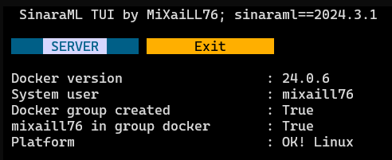
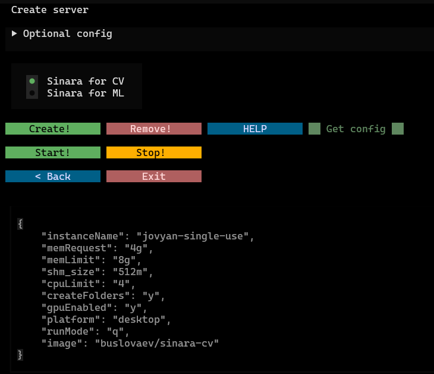

# SinaraX is a TUI for the sinaraml library

## Motivation

It is convenient to have a cli, but it is even more convenient to have a graphical interface for managing this cli.  
As a regular user of sinaraml, I have developed a basic version of the sinaraX library.  
It covers the capabilities of managing servers in sinaraml without using commands in the console.  

## Installation

```bash
pip install sinaraX
```

## Quick Start

```bash
SinaraX
```

### Main Screen



### Server Screen

